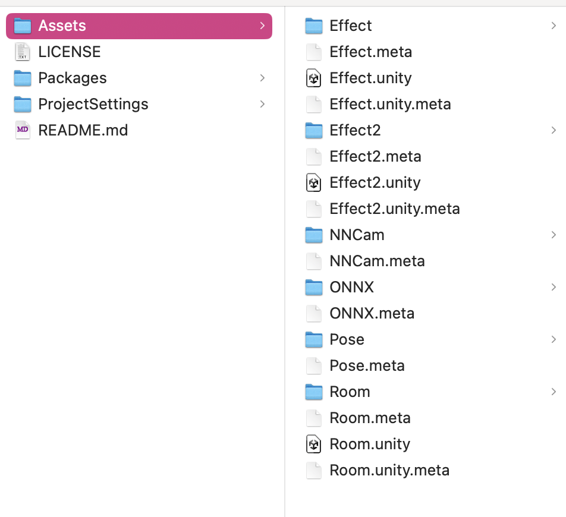
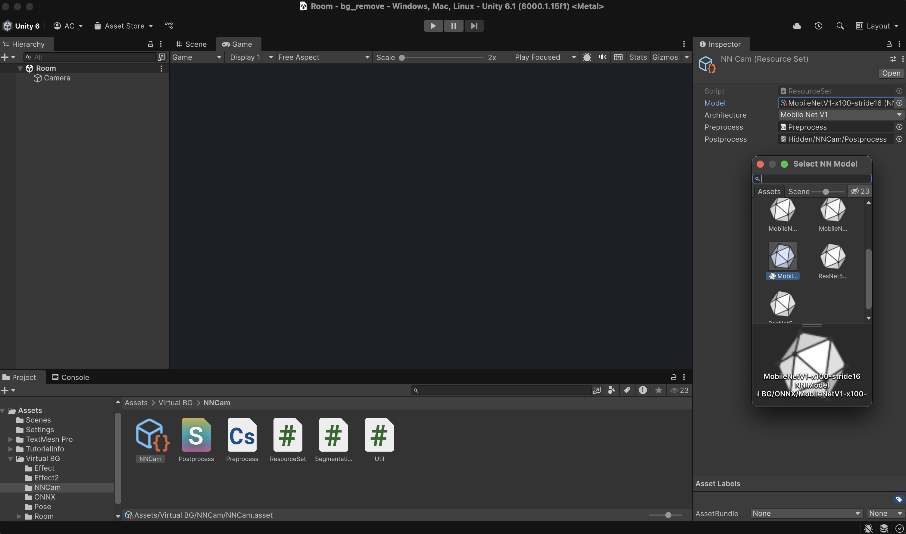
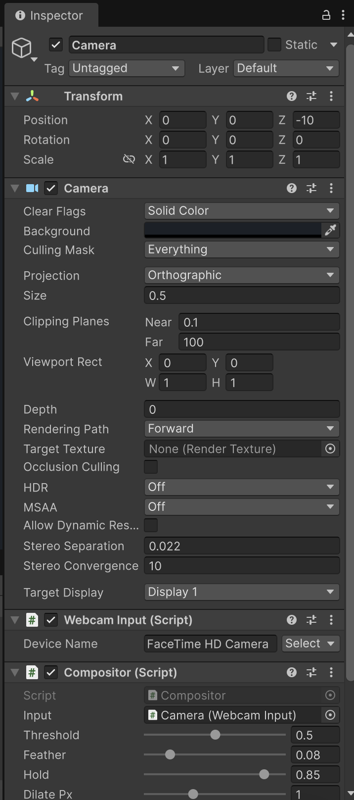
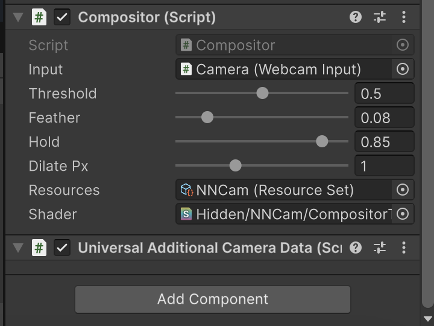
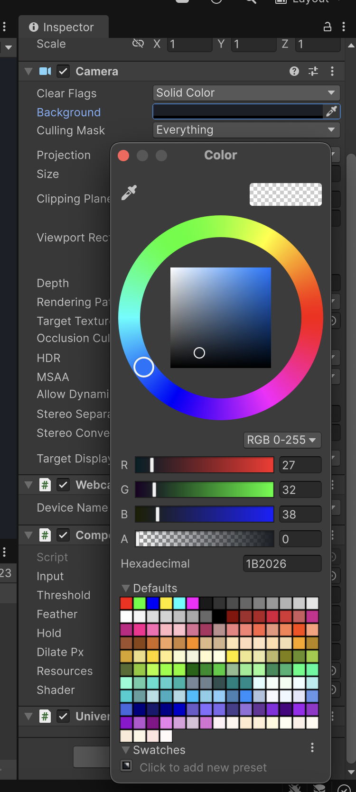
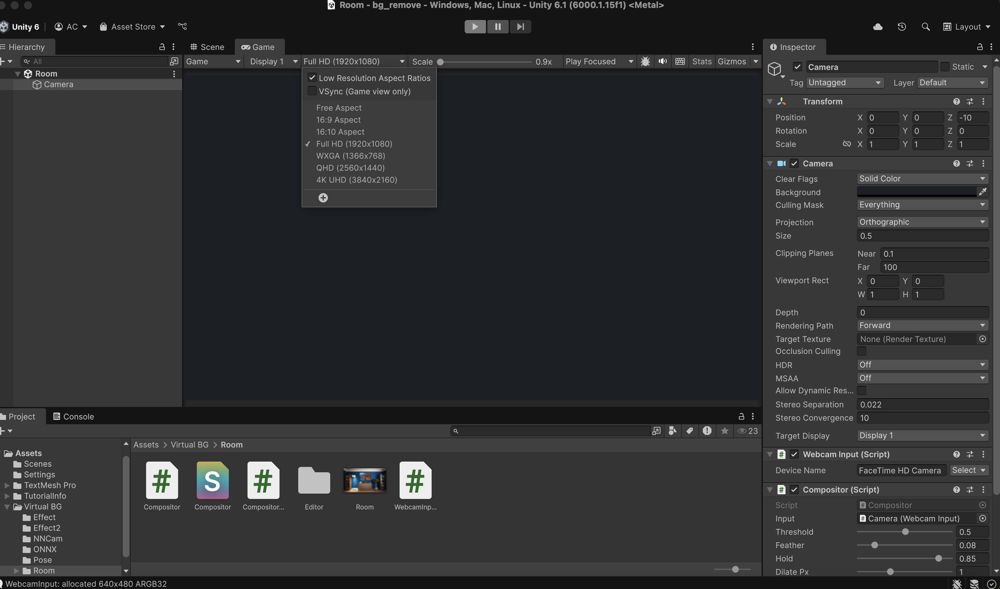
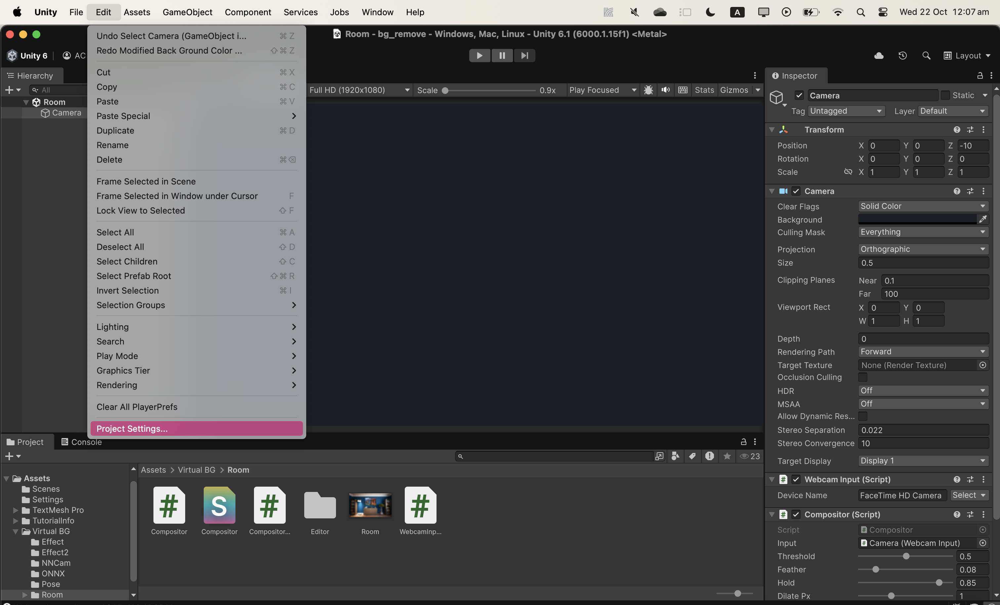
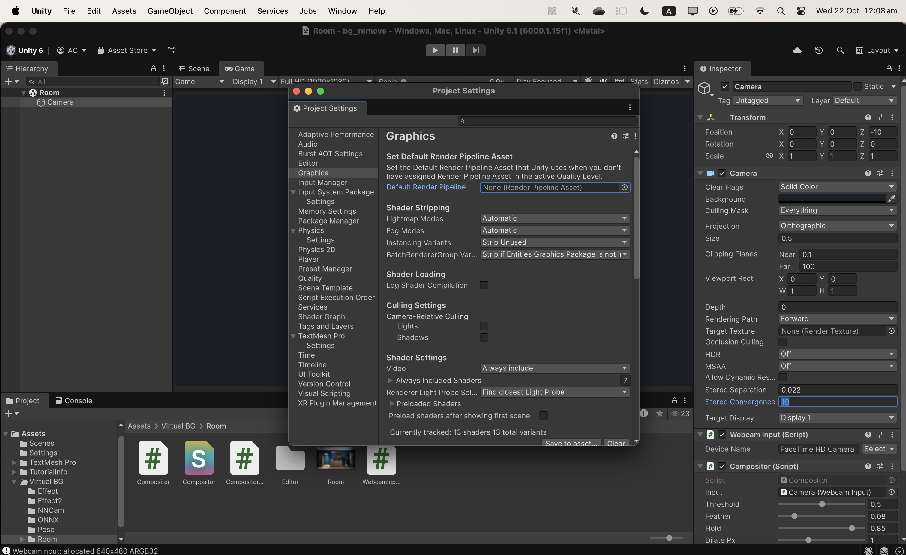
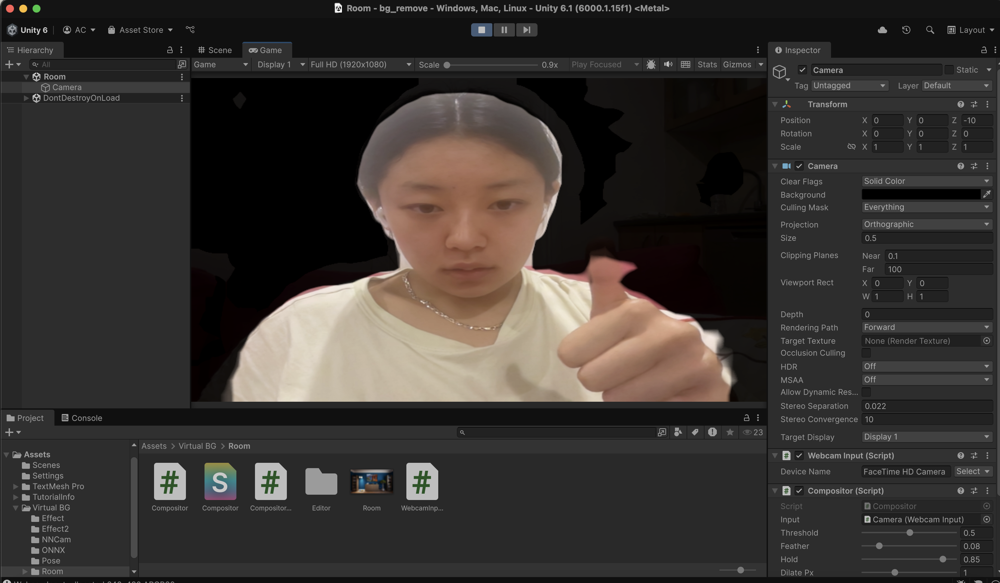

# SampleScene by Virtual Labs

## Project Details  

[Project 10C: Building social connections in virtual worlds](materials/10C Project Brief.pdf)

## Virtual Labs - Members & Roles  

PRIANKA INDLA - Product Owner, Hardware (Device Build and Software) 
SHRAVYA CHANDARASEKAR - Game Engine Software, Hardware (Device Build and Software) 
REYANA KHAN - Game Engine Software, User Testing 
TIA WATUROUCHA - Game Engine Software 
AMBER CHEN - Game Engine Software 
YUAN LIANG - Interactions Design, User Testing

## Repository Organsation 

This repository is organised into the following folders: 
- materials: containing the supporting documents and images for this README file. 
- bg_remove:  containing the project codebase for background removal for body-edge tracking. 
- unitypackage 1:  containing the Unity package for feature INSERT FEATURE HERE. 
- report: containing the [Technical Report](report/Technical%20Report.pdf). 

## Video

This [video](https://drive.google.com/file/d/1xVoj_Eiwpj51UO0Rtrk1rOHaiAB83Vxe/view?usp=sharing) showcases details of the hardware and setup.  

## Device Specifications

SampleScene is built on and for MacOS.  It is a unique installtion system that combines interactive digital drawing interactions ames with the feel and social advantages of physical meetings.

It's features include: 

<ul>
<li>Hardware</li>
<ul>
<li>Physical black out box setup with decorations in coordination with the theme of the drawings (eg. sea themed).</li>
<li>Seashell and string communication system.</li>
<li>Tempered glass used to project the pepper's ghost.</li>
<li>An inbuilt monitor used to project the pepper's ghost. (Power required)</li>
<li>A tripod with a phone used as a webcam to track the user's hand for drawing.</li>
<li>A laptop running the SampleScene project on it, to enable multiple users to engage with the system. This laptop is also connected to the monitor.</li>
<li>An external webcam used in conjunction with the laptop's webcam for both body and hand tracking respectively.</li>
<li>Printed instructions on how to interact with SampleScene.</li>
</ul>
<li>Software</li>
<ul>
<li>Unique hand tracking mechanism used for drawing and colour changing.</li>
<li>Unique body-edge tracking rendering mechanism.</li>
</ul> 
</ul>

## Set-up Instructions

- Plug the monitor into a powerpoint. Switch it on. 
- Slide the tempered glass into it's slot.
- Connect 1 external webcam to the MacOS laptop.
- Ensure that 1 IOS phone is connected to the laptop as well, this will be used as another webcam.
- Setup the phone on the tripod to the height of the user's shoulders. This user will be using the box setup. 
- Setup the webcam to a height on par with the two users' shoulders to allow comfort when hand tracking to draw, and laptop is angled downward a bit to capture the user's face and shoulders in teh body tracking. This user will use the laptop and webcam.
- Run the hand_draw.py file (run python hand_draw.py in terminal).
- Build and run the SampleScene project.
- Drag the build to the monitor, and extend it across both laptop and monitor screen. Adjust the window size as you extend.
- Face the cameras used for drawing (webcam and phone), and pinch to draw. It is recommended to draw slowly at first to ensure your hand is being detected. 

## To install and run the game in a Git Bash shell on a Windows computer

These instructions remain in the prototype code to assist with code debugging and game demonstration on a computer, but will not be available to users of the device.
  
How to setup body tracking   

Follow tutorial here: https://www.youtube.com/watch?v=xKRPwEDwzNg  
Tutorial below:  

https://github.com/Unity-Technologies/barracuda-release  
Download this zip file   

In unity project, navigate to: 
- Windows 
- Package manager
- Add package from disk 
- Select barracuda folder
- Select pacakge.json
- Should be version 3.0.1

https://github.com/keijiro/NNCam  
Download this project   

Navigate to:
- NNCAM
- Assets
- Create new folder in Unity project called VirtualBG
- Drag and drop all files to folder VirtualBG
- eg. effect, effect2, nncam, onyx, pose, room, etc. 
  

Open Room scene   
Click Camera  
Define camera divide name in webcam input script to be laptop's camera  

https://github.com/keijiro/NNCam/releases/tag/v0.0.1  
Download the BodPixOnnx zip file  

Open VirtualBG folder   
Open ONNX folder  
Copy paste all the downloaded files into the folder    

In Room scene Camera  
Choose NNCam resource  
Open NNCam  
Set model to stride16  

Now return to repository:  
https://github.com/ambs02/DECO3801-VirtualLabs

In the bg_remove folder you’ll find NNCam and Room scripts.  In the corresponding files in the Unity project, replace all these scripts

After adding, go to Room scene, and ensure all the inspector settings look like this  
VERY IMPORTANT: in the colour, make sure that A value is set to 0  

Change the screen size from Free Aspect -> Full HD  


Navigate to EDIT -> Project Settings -> Graphics  

Set Render Pipeline to None  


Run the game    
Example:

